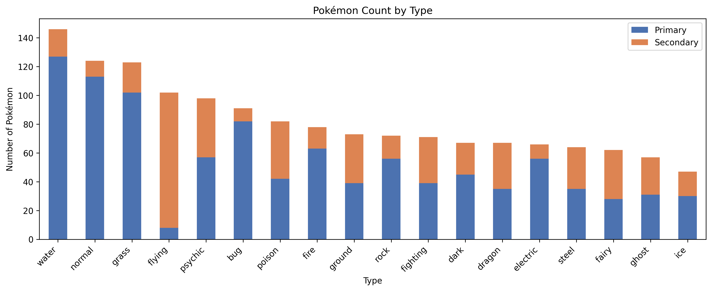
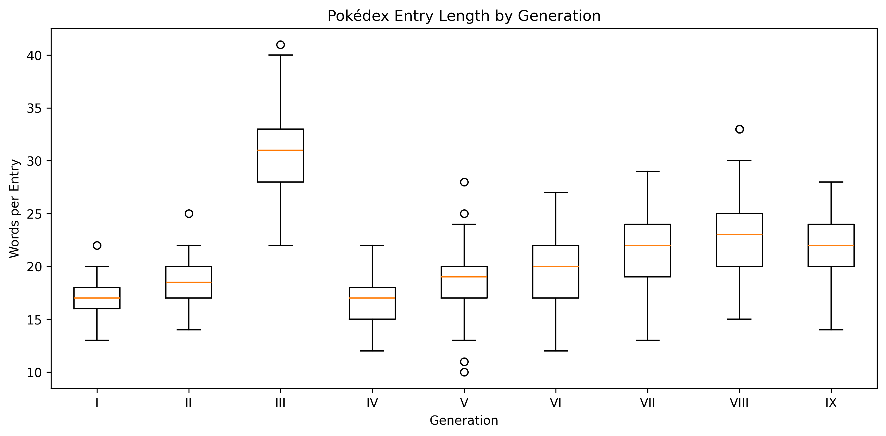
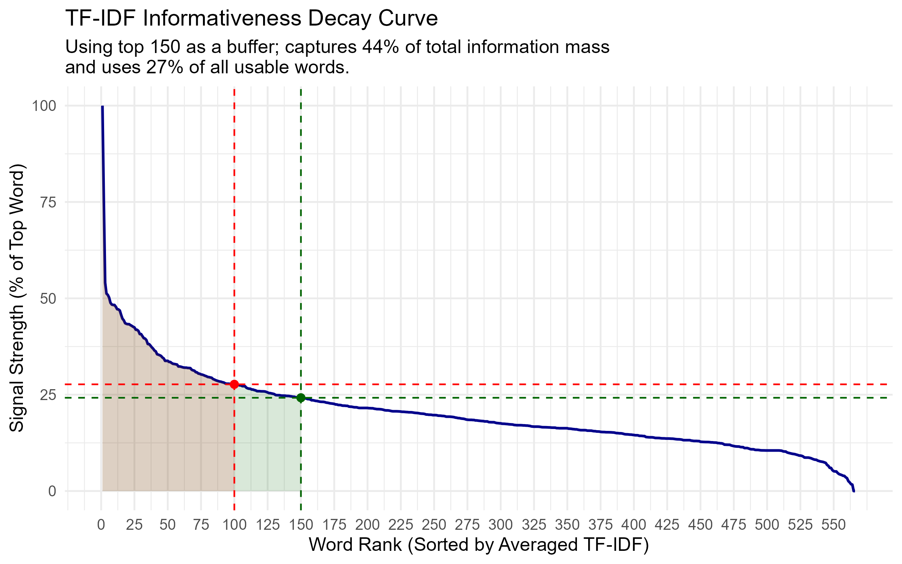
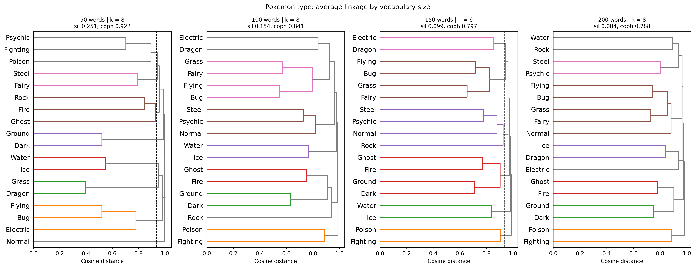
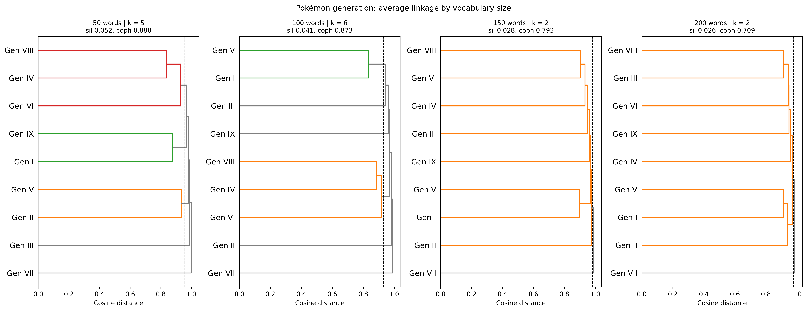
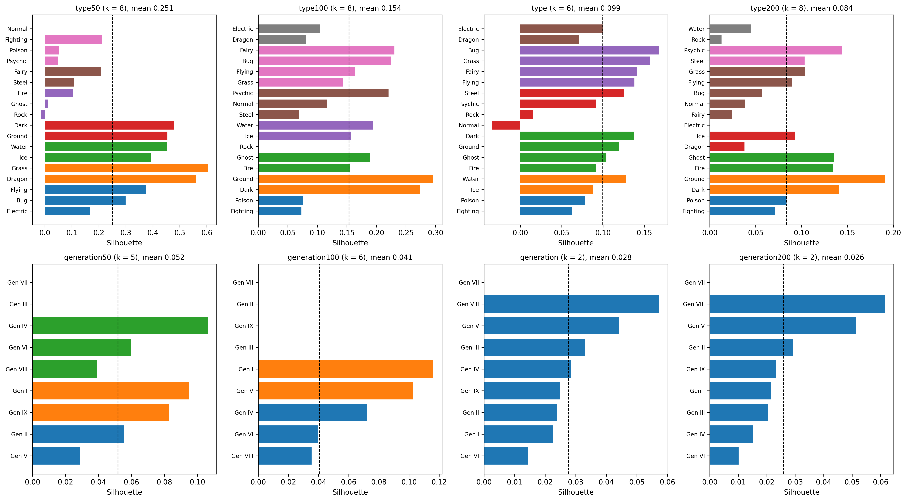
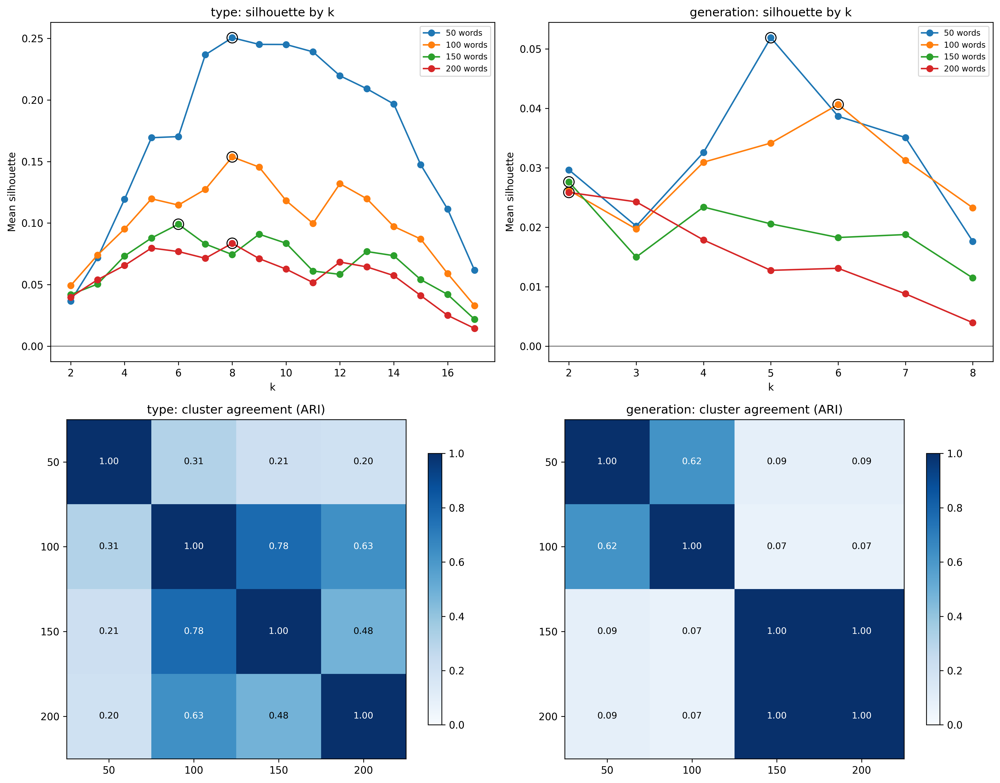

# Exploring Data
## Type Counts

This graph shows the breakdown of the Pokémon types, including both dual and solo typing. Using this information, we decided to use both types for our clustering instead of just primary typing, as this would heavily affect types like Flying.

## Pokédex Entry Lengths

This graph shows the average length of a Pokédex entry for each generation. Some of the findings are that Generation III tends to have longer Pokédex entries, while other generations are more closely aligned with each other. 

## Informativeness Decay Curve

This graph shows the decay in a word's informativeness (signal strength) as it gets progressively further from the most informative word (rank 1). Although the curve does not exhibit a distinct plateau, the rate of decline becomes progressively smaller, with noticeable diminishing returns around 50-100 words. This indicates that adding words beyond this range contributes progressively less additional information while increasing the dimensionality (and complexity) of the model. We therefore selected the top 150 words as a buffer that captures additional information beyond the region of greatest signal decay while limiting unnecessary complexity. At 150 words, the selected features capture 44% of the total information mass (total area under curve) while representing only 27% of all usable words. 

# Models
## Dendrograms

As shown in the dendrograms above, the 50-word vocabulary produced the highest silhouette and cophenetic correlation scores for both generation and type, and both metrics declined as vocabulary size increased. However, the 50-word groupings were unstable: several of its pairings (e.g., Gen I with Gen IX, Gen II with Gen V) did not appear at any larger vocabulary size. At 100 words, the main groupings (Gen I with Gen V, Gen IV with Gen VIII, and Gen VII as an outlier) largely persisted at 150 and 200 words, while scores remained close to the 50-word result. We therefore used 100 words, as it balanced cluster quality against stability across vocabulary sizes.

## Primary Silhouette Analysis

The silhouette plots show how well each type and generation fits within its assigned cluster across the four vocabulary sizes (50, 100, 150, and 200 words).
Mean silhouette decreases as vocabulary size increases, with the 50-word vocabulary scoring highest. However, several groupings appear consistently across vocabulary sizes: Dark with Ground (the strongest cluster at 100 and 200 words), Fire with Ghost, Poison with Fighting, and Bug with Flying (joined by Grass from 100 words on). The 100-word vocabulary has no types with negative silhouette values, whereas Rock is slightly negative at 50 words and Normal is negative at 150 words, indicating those types were placed in clusters they fit poorly. At 50 words, the Fighting/Poison/Psychic and Fire/Ghost/Rock clusters also contain members with near-zero scores, suggesting weaker cohesion than the overall mean implies.

## Choosing k and Stability Across Vocabulary Sizes (ARI and Silhouette Scores)

**Silhouette by k.** For type, mean silhouette peaks at k = 8 for the 50, 100, and 200 word vocabularies (0.251, 0.154, and 0.084), and at k = 6 for 150 words (0.099). The consistent peak at k = 8 suggests the type data has a similar underlying structure regardless of vocabulary size, even though overall scores decline as more words are added. For generation, the best k is 5 for 50 words (0.052) and 6 for 100 words (0.041), while both 150 and 200 words peak at k = 2 (about 0.026 to 0.028). Generation scores remain very low at every k, consistent with weak cluster structure between generations.

**ARI.** The ARI measures how similar the cluster assignments are between two vocabulary sizes. For type, the 50-word clusters agree poorly with every larger vocabulary (0.20 to 0.31), while the 100-word clusters agree strongly with 150 words (0.78) and moderately with 200 words (0.63). The 100-word vocabulary has the highest agreement with the other sizes overall, making it the most stable choice. For generation, 50 and 100 words agree moderately (0.62), and 150 and 200 words produce identical clusters (1.00), but the two pairs have almost no agreement with each other (0.07 to 0.09). This split reflects the larger vocabularies collapsing to k = 2, where nearly all generations fall into a single cluster.

**Conclusion.** The ARI results support the use of the 100-word vocabulary. For type, the 50-word vocabulary scores highest on silhouette but produces clusters that are not reproduced at any larger size, while the 100-word clusters remain largely consistent at 150 and 200 words. For generation, the 100-word vocabulary preserves more structure than 150 or 200 words, which reduce to a single large cluster.
