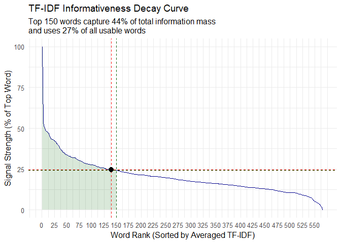

DS4002 Pokemon Project Data Cleaning
================
Caroline Clippinger
2026-09-25

# General Information

This data cleaning script is purposed with preparing the Pokemon type x
word and Pokemon generation x word matrices to use for our hierarchical
clustering analysis. The necessary data file can be found at
DS-4002-group-01/project1/DATA/pokedex.csv in the github. It also
requires the following packages: `here`, `tidyverse`, `tidytext`,
`textdata`, and `udpipe`. To install these packages use the
`install.packages("package_name")` syntax.

# Loading Packages and Data

``` r
knitr::opts_chunk$set(echo = TRUE)
library(here) # for loading data
```

    ## here() starts at C:/Users/Caroline Clippinger/OneDrive/Documents/DS-4002-group-01

``` r
library(tidyverse) # for general data wrangling and string manipulation
```

    ## ── Attaching core tidyverse packages ──────────────────────── tidyverse 2.0.0 ──
    ## ✔ dplyr     1.2.1     ✔ readr     2.2.0
    ## ✔ forcats   1.0.1     ✔ stringr   1.6.0
    ## ✔ ggplot2   4.0.3     ✔ tibble    3.3.1
    ## ✔ lubridate 1.9.5     ✔ tidyr     1.3.2
    ## ✔ purrr     1.2.2

    ## ── Conflicts ────────────────────────────────────────── tidyverse_conflicts() ──
    ## ✖ dplyr::filter() masks stats::filter()
    ## ✖ dplyr::lag()    masks stats::lag()
    ## ℹ Use the conflicted package (<http://conflicted.r-lib.org/>) to force all conflicts to become errors

``` r
library(tidytext) # for working with the text
library(textdata) # for afinn lexicon to do sentiment analysis
library(udpipe) # for the smart word cleaning and lemmatization


pokemon <- read.csv(here("project1/DATA/", "pokedex.csv"))
```

# Data Cleaning

## Adressing Missing Type Data

``` r
# Checking for pokemon missing type information
cat("The following", length(pokemon[pokemon$type_1 == "" | is.na(pokemon$type_1), "name"]), "pokemon have missing type information:\n", paste(pokemon[pokemon$type_1 == "" | is.na(pokemon$type_1), "name"]))
```

    ## The following 37 pokemon have missing type information:
    ##  deoxys wormadam giratina shaymin basculin darmanitan frillish jellicent tornadus thundurus landorus keldeo meloetta pyroar meowstic aegislash pumpkaboo gourgeist zygarde oricorio lycanroc wishiwashi minior mimikyu toxtricity eiscue indeedee morpeko urshifu basculegion enamorus oinkologne maushold squawkabilly palafin tatsugiri dudunsparce

``` r
# Researching the type information for those pokemon and creating a reference table
researched_types <- tribble(
  ~name, ~type_1, ~type_2,
  "deoxys", "psychic", NA,
  "wormadam", "bug", NA, # depending on cloak second type changes so leaving it empty since its basic cloak is bug
  "giratina", "ghost", "dragon", 
  "shaymin", "grass", NA, # using the sky form type because description talks about flowering plant
  "basculin", "water", NA,
  "darmanitan", "fire", NA,
  "frillish", "water", "ghost", 
  "jellicent", "water", "ghost",
  "tornadus", "flying", NA,
  "thundurus", "electric", "flying",
  "landorus", "ground", "flying",
  "keldeo", "water", "fighting", 
  "meloetta", "normal", "psychic", # this is default form types
  "pyroar", "fire", "normal",
  "meowstic", "psychic", NA,
  "aegislash", "steel", "ghost",
  "pumpkaboo", "ghost", "grass",
  "gourgeist", "ghost", "grass",
  "zygarde", "dragon", "ground",
  "oricorio", "fire", "flying", # based on the color and description i can assume its referencing the fire baile style form
  "lycanroc", "rock", NA,
  "wishiwashi", "water", NA,
  "minior", "rock", "flying",
  "mimikyu", "ghost", "fairy", 
  "toxtricity", "electric", "poison",
  "eiscue", "ice", NA,
  "indeedee", "psychic", "normal",
  "morpeko", "electric", "dark", 
  "urshifu", "fighting", "dark", # looked up description depending on form to determine if it is dark or water
  "basculegion", "water", "ghost", 
  "enamorus", "fairy", "flying",
  "oinkologne", "normal", NA,
  "maushold", "normal", NA,
  "squawkabilly", "normal", "fighting",
  "palafin", "water", NA,
  "tatsugiri", "dragon", "water",
  "dudunsparce", "normal", NA
)

# Updating types with reference table and checking if still no missings
pokemon_updated <- pokemon %>% 
  rows_update(researched_types, by = "name", unmatched = "ignore")

cat("\n\nAfter updating the data with the reference table there are now these pokemon missing type information:\n")
```

    ## 
    ## 
    ## After updating the data with the reference table there are now these pokemon missing type information:

``` r
print(pokemon_updated[pokemon_updated$type_1 == "" | is.na(pokemon_updated$type_1), "name"])
```

    ## character(0)

## Extracting Words Using NLP

``` r
# Loading English NLP model for tokenizing data
ud_model <- udpipe_download_model(language = "english")
```

    ## Downloading udpipe model from https://raw.githubusercontent.com/jwijffels/udpipe.models.ud.2.5/master/inst/udpipe-ud-2.5-191206/english-ewt-ud-2.5-191206.udpipe to C:/Users/Caroline Clippinger/OneDrive/Documents/DS-4002-group-01/project1/SCRIPTS/english-ewt-ud-2.5-191206.udpipe

    ##  - This model has been trained on version 2.5 of data from https://universaldependencies.org

    ##  - The model is distributed under the CC-BY-SA-NC license: https://creativecommons.org/licenses/by-nc-sa/4.0

    ##  - Visit https://github.com/jwijffels/udpipe.models.ud.2.5 for model license details.

    ##  - For a list of all models and their licenses (most models you can download with this package have either a CC-BY-SA or a CC-BY-SA-NC license) read the documentation at ?udpipe_download_model. For building your own models: visit the documentation by typing vignette('udpipe-train', package = 'udpipe')

    ## Downloading finished, model stored at 'C:/Users/Caroline Clippinger/OneDrive/Documents/DS-4002-group-01/project1/SCRIPTS/english-ewt-ud-2.5-191206.udpipe'

``` r
# Extracting the file model
ud_model <- udpipe_load_model(ud_model$file_model)

# Conducting preliminary pokedex entry cleaning to prevent confusing the model
pokemon_smart_clean <- pokemon_updated %>% 
  mutate(
    pokedex_entry_clean = str_replace_all(pokedex_entry, "é", "e"),
    pokedex_entry_clean = str_remove_all(pokedex_entry_clean, "[“”'’‘\"−°—-]"),
    pokedex_entry_clean = str_replace_all(pokedex_entry, "an other", "another"), # noticed this typo when exploring entries
    pokedex_entry_clean = str_replace_all(pokedex_entry, "elec tricity", "electricity") # noticed this typo when exploring entries
  )

# "Annotating" the pokedex entry data, dividing documents by the pokemon name
entry_analysis <- udpipe_annotate(
  ud_model, # model loaded then extracted earlier
  x = pokemon_smart_clean$pokedex_entry_clean, # the text we want the NLP to run on 
  doc_id = pokemon_smart_clean$name, # how to differentiate documents (in our case pokedex entries)
) %>% 
  as.data.frame() # converting to data frame

# Selecting relevant columns from the NLP annotation and applying filtering
pokemon_words <- entry_analysis %>% 
  select(name = doc_id, entry_sentence = sentence, word_og = token, word_root = lemma, pos = upos) %>% 
  filter(!pos %in% c("PUNCT","NUM")) %>% # We do not care about punctuation or numbers as 'descriptive language'
  filter(!str_detect(word_root, "'s")) %>% # We do not want to handle 's (shouldn't happen because of earlier cleaning, but just in case)
  mutate(word_root = str_to_lower(word_root)) %>% # Converting roots (lemmas) to lowercase (should do automatically, but extra precaution)
  filter(nchar(word_root) > 2) # Removing any words with a lemma of 2 characters or less 
```

### Visualizing output

``` r
head(pokemon_words, 25) # visualizing
```

    ##         name
    ## 1  bulbasaur
    ## 2  bulbasaur
    ## 3  bulbasaur
    ## 4  bulbasaur
    ## 5  bulbasaur
    ## 6  bulbasaur
    ## 7  bulbasaur
    ## 8  bulbasaur
    ## 9  bulbasaur
    ## 10 bulbasaur
    ## 11 bulbasaur
    ## 12 bulbasaur
    ## 13 bulbasaur
    ## 14 bulbasaur
    ## 15   ivysaur
    ## 16   ivysaur
    ## 17   ivysaur
    ## 18   ivysaur
    ## 19   ivysaur
    ## 20   ivysaur
    ## 21   ivysaur
    ## 22   ivysaur
    ## 23   ivysaur
    ## 24   ivysaur
    ## 25   ivysaur
    ##                                                                                      entry_sentence
    ## 1                                                  A strange seed was planted on its back at birth.
    ## 2                                                  A strange seed was planted on its back at birth.
    ## 3                                                  A strange seed was planted on its back at birth.
    ## 4                                                  A strange seed was planted on its back at birth.
    ## 5                                                  A strange seed was planted on its back at birth.
    ## 6                                                  A strange seed was planted on its back at birth.
    ## 7                                                    The plant sprouts and grows with this POKéMON.
    ## 8                                                    The plant sprouts and grows with this POKéMON.
    ## 9                                                    The plant sprouts and grows with this POKéMON.
    ## 10                                                   The plant sprouts and grows with this POKéMON.
    ## 11                                                   The plant sprouts and grows with this POKéMON.
    ## 12                                                   The plant sprouts and grows with this POKéMON.
    ## 13                                                   The plant sprouts and grows with this POKéMON.
    ## 14                                                   The plant sprouts and grows with this POKéMON.
    ## 15 When the bulb on its back grows large, it appears to lose the ability to stand on its hind legs.
    ## 16 When the bulb on its back grows large, it appears to lose the ability to stand on its hind legs.
    ## 17 When the bulb on its back grows large, it appears to lose the ability to stand on its hind legs.
    ## 18 When the bulb on its back grows large, it appears to lose the ability to stand on its hind legs.
    ## 19 When the bulb on its back grows large, it appears to lose the ability to stand on its hind legs.
    ## 20 When the bulb on its back grows large, it appears to lose the ability to stand on its hind legs.
    ## 21 When the bulb on its back grows large, it appears to lose the ability to stand on its hind legs.
    ## 22 When the bulb on its back grows large, it appears to lose the ability to stand on its hind legs.
    ## 23 When the bulb on its back grows large, it appears to lose the ability to stand on its hind legs.
    ## 24 When the bulb on its back grows large, it appears to lose the ability to stand on its hind legs.
    ## 25 When the bulb on its back grows large, it appears to lose the ability to stand on its hind legs.
    ##    word_og word_root   pos
    ## 1  strange   strange   ADJ
    ## 2     seed      seed  NOUN
    ## 3  planted     plant  VERB
    ## 4      its       its  PRON
    ## 5     back      back   ADV
    ## 6    birth     birth  NOUN
    ## 7      The       the   DET
    ## 8    plant     plant  NOUN
    ## 9  sprouts    sprout  NOUN
    ## 10     and       and CCONJ
    ## 11   grows      grow  VERB
    ## 12    with      with   ADP
    ## 13    this      this   DET
    ## 14 POKéMON   pokémon  NOUN
    ## 15    When      when   ADV
    ## 16     the       the   DET
    ## 17    bulb      bulb  NOUN
    ## 18     its       its  PRON
    ## 19    back      back   ADV
    ## 20   grows      grow  VERB
    ## 21   large     large   ADJ
    ## 22 appears    appear  VERB
    ## 23    lose      lose  VERB
    ## 24     the       the   DET
    ## 25 ability   ability  NOUN

## Additional word cleaning

``` r
# Preparing vectors of unqualified descriptive words
# Pokemon names - extracting from data itself
poke_names <- unique(str_to_lower(str_trim(pokemon_updated$name, side = "both")))

# Pokemon region names (one per game/generation) - googled these
poke_regions <- c("kanto", "johto", "hoenn", "sinnoh", "unova", "kalos", "alola", "galar", "paldea")

# Pokemon types - extracting from data itself
poke_types <- unique(pokemon_updated$type_1)

# General in-game Pokemon terminology (in their lemma form)
poke_game_terms <- c("pokemon", "version", "game", "attack", "battle", "region", "evolve", "move", "mega", "legendary")  

pokemon_words <- pokemon_words %>% 
  # Removal Rule 1: Removing any words that are generation specific (region name), that are the names of types, that are the names of pokemon, and that are basic pokemon game mechanic language
  mutate(word_root = str_trim(word_root, side = "both")) %>% # making sure no whitespace messes up the filtering
  filter(!word_root %in% poke_names) %>% # removing pokemon names
  filter(!word_root %in% poke_regions) %>% # removing pokemon game regions
  filter(!word_root %in% poke_types) %>% # removing pokemon types
  filter(!word_root %in% poke_game_terms) # removing pokemon in-game terminology

# Loading filler words from tidytext
data("stop_words") # returns a dataframe of various stop words (AKA filler words) in English which are not informative

pokemon_words <- pokemon_words %>% 
  # Removal Rule 2: Removing any basic filler words using "stop_words"
  anti_join(stop_words, by = c("word_root" = "word")) %>%  # essentially removes the words that have crossover, in this case fillers
  # Rule 3: Removing any word fragment that may exist like hp
  filter(nchar(word_root) > 2) # removing very short word fragments (did this earlier too, but incase they made it through because why not)

# Checking effect of Rule 1
# The following pokemon had examples of Rule 1 cases
# Ekans has pokemon names in it; Dialga has region name in it; Wartortle has type in it
print("Checking Rule 1 using the following examples:\n\tEkans for pokemon names\n\tDialga for region name\n\tWartortle for type name")
```

    ## [1] "Checking Rule 1 using the following examples:\n\tEkans for pokemon names\n\tDialga for region name\n\tWartortle for type name"

``` r
print(pokemon_words[pokemon_words$name %in% c("ekans", "dialga", "wartortle"), ])
```

    ##           name                                             entry_sentence
    ## 52   wartortle                 Often hides in water to stalk unwary prey.
    ## 53   wartortle                 Often hides in water to stalk unwary prey.
    ## 54   wartortle                 Often hides in water to stalk unwary prey.
    ## 55   wartortle                 Often hides in water to stalk unwary prey.
    ## 56   wartortle  For swimming fast, it moves its ears to maintain balance.
    ## 57   wartortle  For swimming fast, it moves its ears to maintain balance.
    ## 58   wartortle  For swimming fast, it moves its ears to maintain balance.
    ## 59   wartortle  For swimming fast, it moves its ears to maintain balance.
    ## 60   wartortle  For swimming fast, it moves its ears to maintain balance.
    ## 162      ekans                             Moves silently and stealthily.
    ## 163      ekans                             Moves silently and stealthily.
    ## 164      ekans Eats the eggs of birds, such as PIDGEY and SPEAROW, whole.
    ## 165      ekans Eats the eggs of birds, such as PIDGEY and SPEAROW, whole.
    ## 166      ekans Eats the eggs of birds, such as PIDGEY and SPEAROW, whole.
    ## 4264    dialga                          It has the power to control time.
    ## 4265    dialga                          It has the power to control time.
    ## 4266    dialga                          It has the power to control time.
    ## 4267    dialga     It appears in Sinnoh-region myths as an ancient deity.
    ## 4268    dialga     It appears in Sinnoh-region myths as an ancient deity.
    ## 4269    dialga     It appears in Sinnoh-region myths as an ancient deity.
    ##         word_og  word_root  pos
    ## 52        hides       hide NOUN
    ## 53        stalk      stalk VERB
    ## 54       unwary     unwary  ADJ
    ## 55         prey       prey NOUN
    ## 56     swimming      swimm NOUN
    ## 57         fast       fast  ADV
    ## 58         ears       ears NOUN
    ## 59     maintain   maintain VERB
    ## 60      balance    balance NOUN
    ## 162    silently   silently  ADV
    ## 163  stealthily stealthily  ADV
    ## 164        Eats        eat VERB
    ## 165        eggs        egg NOUN
    ## 166       birds       bird NOUN
    ## 4264      power      power NOUN
    ## 4265    control    control VERB
    ## 4266       time       time NOUN
    ## 4267      myths       myth NOUN
    ## 4268    ancient    ancient  ADJ
    ## 4269      deity      deity NOUN

``` r
# Joining the cleaned words with the rest of the data
pokemon_cleaned <- left_join(pokemon_smart_clean, pokemon_words, by = "name") %>% 
  select(-pokedex_entry) # removing the pokedex entry variable that wasn't used when extracting words (keeping the cleaned one we fed into function instead)

# Making missings all be NA (will need this once we pivot-long for type data)
pokemon_cleaned[pokemon_cleaned == ""] <- NA
```

## Applying TF-IDF

**Explaining terminology:**  
TF (Term Frequency) = how often a word appears within a Pokemon type
(count of word in type / count of all words in type)

IDF (Inverse Document Frequency) = how rare a word is across all Pokemon
types (math is log(n_types/n_types using word at least once)) - there
are 18 types (`pokemon_long`)

TF_IDF = how unique a word is for a type (TF \* IDF), will be higher
when a word appears a lot within a type (high TF) and when it only
appears in a select few types (high IDF)

### Type-based profiles computations

``` r
# Making type long so that dual-types are considered in the counts for both types
pokemon_type_long <- pokemon_cleaned %>% 
  pivot_longer(
    cols = c(type_1, type_2),
    names_to = "type_slot",
    values_to = "type",
    values_drop_na = TRUE # this way pokemon with only one type stick to having one row
  )

# Creating type profiles by using tf-idf
type_profiles <- pokemon_type_long %>% 
  group_by(type, word_root) %>% # want a unique tf-idf for each word for each pokemon type
  summarise(
    n = n(), # will say how many times the word appears in that type
    n_pokemon = n_distinct(name), # will say how many pokemon of that type have this word in their description
    .groups = "drop"
  ) %>% 
  filter(n_pokemon >= 2) %>% # Setting condition that at least two pokemon need to have that descriptive word within their entry
  bind_tf_idf(word_root, type, n) %>% # calculating tf-idf
  arrange(type, desc(tf_idf)) # Organizing how it looks so higher tf-idf appears first

# Calculating average TF-IDF score across types
type_word_scores <- type_profiles %>% 
  group_by(word_root) %>% 
  summarise(
    type_mean_tfidf = mean(tf_idf)
  ) %>% 
  arrange(desc(type_mean_tfidf))

# Checking basic things:
cat("In the type-profiles there are", length(unique(type_profiles$type)), "unique types.") # should indicate 18 unique types
```

    ## In the type-profiles there are 18 unique types.

``` r
# Getting an idea of how many unique words there are in general
cat("\n\nThere are", length(unique(type_profiles$word_root)), "unique words in the type-profiles")
```

    ## 
    ## 
    ## There are 751 unique words in the type-profiles

### Generation-based profile computations

``` r
# Creating generation profiles by using tf-idf

# Check the type-profiles for code explanation (it is identical except for using generation instead of type)
gen_profiles <- pokemon_cleaned %>% 
  group_by(generation, word_root) %>% 
  summarise(
    n = n(),
    n_pokemon = n_distinct(name),
    .groups = "drop"
  ) %>% 
  filter(n_pokemon >= 2) %>% # Setting condition that at least two pokemon need to have that descriptive word within their entry
  bind_tf_idf(word_root, generation, n) %>% 
  arrange(generation, desc(tf_idf))

# Calculating average TF-IDF score across generations
gen_word_scores <- gen_profiles %>% 
  group_by(word_root) %>% 
  summarise(
    gen_mean_tfidf = mean(tf_idf)
  ) %>% 
  arrange(desc(gen_mean_tfidf))

# Checking basic things:
cat("In the generation-profiles there are", length(unique(gen_profiles$generation)), "unique generations") # should indicate 9 unique generations
```

    ## In the generation-profiles there are 9 unique generations

``` r
# Getting an idea of how many unique words there are in general
cat("\n\nThere are", length(unique(gen_profiles$word_root)), "unique words in the generation-profiles")
```

    ## 
    ## 
    ## There are 691 unique words in the generation-profiles

### Assessing TF-IDF

``` r
print("Top 20 TF-IDF words in type-based profiles")
```

    ## [1] "Top 20 TF-IDF words in type-based profiles"

``` r
print(head(type_word_scores, 20))
```

    ## # A tibble: 20 × 2
    ##    word_root   type_mean_tfidf
    ##    <chr>                 <dbl>
    ##  1 snow                 0.102 
    ##  2 icy                  0.0584
    ##  3 snowy                0.0584
    ##  4 freeze               0.0562
    ##  5 sand                 0.0526
    ##  6 soul                 0.0503
    ##  7 fear                 0.0482
    ##  8 cold                 0.0461
    ##  9 age                  0.0438
    ## 10 breath               0.0438
    ## 11 frigid               0.0438
    ## 12 fireball             0.0416
    ## 13 set                  0.0416
    ## 14 muscle               0.0414
    ## 15 spark                0.0413
    ## 16 electricity          0.0411
    ## 17 salt                 0.0389
    ## 18 smell                0.0382
    ## 19 spirit               0.0376
    ## 20 hammer               0.0374

``` r
print("Top 20 TF-IDF words in generation-based profiles")
```

    ## [1] "Top 20 TF-IDF words in generation-based profiles"

``` r
print(head(gen_word_scores, 20))
```

    ## # A tibble: 20 × 2
    ##    word_root  gen_mean_tfidf
    ##    <chr>               <dbl>
    ##  1 ultra              0.0741
    ##  2 magazine           0.0345
    ##  3 ears               0.0328
    ##  4 beasts             0.0309
    ##  5 paranormal         0.0276
    ##  6 beast              0.0247
    ##  7 hidden             0.0246
    ##  8 inhabit            0.0246
    ##  9 twig               0.0246
    ## 10 cloak              0.0243
    ## 11 honey              0.0243
    ## 12 shock              0.0233
    ## 13 timid              0.0233
    ## 14 touch              0.0233
    ## 15 coal               0.0207
    ## 16 internal           0.0195
    ## 17 creature           0.0189
    ## 18 asleep             0.0185
    ## 19 balloon            0.0185
    ## 20 dangerous          0.0185

``` r
# Merging the two
common_words <- type_word_scores %>% 
  inner_join(gen_word_scores, by = "word_root") %>% 
  mutate(
    avg_tfidf = (type_mean_tfidf + gen_mean_tfidf)/2
  ) %>% 
  arrange(desc(avg_tfidf))

print("Top 20 averaged TF-IDF words across type and generation profiles")
```

    ## [1] "Top 20 averaged TF-IDF words across type and generation profiles"

``` r
print(head(common_words, 20))
```

    ## # A tibble: 20 × 4
    ##    word_root  type_mean_tfidf gen_mean_tfidf avg_tfidf
    ##    <chr>                <dbl>          <dbl>     <dbl>
    ##  1 snow                0.102         0.00975    0.0560
    ##  2 ultra               0.0104        0.0741     0.0423
    ##  3 freeze              0.0562        0.00426    0.0303
    ##  4 cold                0.0461        0.0113     0.0287
    ##  5 sand                0.0526        0.00437    0.0285
    ##  6 soul                0.0503        0.00591    0.0281
    ##  7 fear                0.0482        0.00650    0.0273
    ##  8 frigid              0.0438        0.0104     0.0271
    ##  9 wormhole            0.0355        0.0185     0.0270
    ## 10 ears                0.0213        0.0328     0.0270
    ## 11 breath              0.0438        0.00975    0.0268
    ## 12 internal            0.0333        0.0195     0.0264
    ## 13 salt                0.0389        0.0138     0.0264
    ## 14 set                 0.0416        0.0108     0.0262
    ## 15 hammer              0.0374        0.0138     0.0256
    ## 16 hidden              0.0255        0.0246     0.0250
    ## 17 twig                0.0250        0.0246     0.0248
    ## 18 timid               0.0255        0.0233     0.0244
    ## 19 fireball            0.0416        0.00691    0.0243
    ## 20 expedition          0.0312        0.0173     0.0242

``` r
# Extracting the top 150 words to use for clustering features
top_150_df <- common_words %>% 
  slice_head(n = 150)

top_150_words <- top_150_df$word_root
```

### Determining best feature count

``` r
n_unique_words = length(unique(common_words$word_root))
cat("There are", n_unique_words, "unique common words that meet requirements.")
```

    ## There are 566 unique common words that meet requirements.

``` r
# Preparing informativeness metrics
informativeness <- data.frame(
  word_root = common_words$word_root,
  avg_tfidf = common_words$avg_tfidf
) %>% 
  mutate(
    rank = row_number(), # arranged by avg_tfidf in descending order so 1 is the most informative word
    pct_total_vocab = rank/max(rank)*100, # getting percent of total possible vocab
    signal_strength_pct = (avg_tfidf / first(avg_tfidf))*100, # the word with the highest average TF-IDF is considered the most informative because it tells the most as to which type/generation a pokemon belongs to, so every other word after in the rankings will be a percentage of this
    cumulative_mass_pct = (cumsum(avg_tfidf)/sum(avg_tfidf))*100, # this gives the percent of total amount of TF-IDF information contributed by all words ranked up to this point
    slope = (signal_strength_pct - lag(signal_strength_pct)) / (rank - lag(rank)), # getting slope at each point
    slope_change = slope - lag(slope) # change in slope
  )

# Metrics at certain ranks
informativeness %>% 
  filter(rank %in% seq(0, 300, by = 5)) %>% 
  print()
```

    ##      word_root   avg_tfidf rank pct_total_vocab signal_strength_pct
    ## 1         sand 0.028482614    5       0.8833922            50.89096
    ## 2         ears 0.027023565   10       1.7667845            48.28402
    ## 3       hammer 0.025593933   15       2.6501767            45.72964
    ## 4   expedition 0.024232420   20       3.5335689            43.29698
    ## 5        spark 0.023757729   25       4.4169611            42.44883
    ## 6       muscle 0.022793661   30       5.3003534            40.72629
    ## 7         silk 0.021354215   35       6.1837456            38.15438
    ## 8       spirit 0.020412263   40       7.0671378            36.47136
    ## 9    dangerous 0.019617724   45       7.9505300            35.05172
    ## 10      source 0.018904894   50       8.8339223            33.77808
    ## 11      flower 0.018449608   55       9.7173145            32.96461
    ## 12       punch 0.018044027   60      10.6007067            32.23994
    ## 13       fiery 0.017873783   65      11.4840989            31.93576
    ## 14         bud 0.017471363   70      12.3674912            31.21674
    ## 15      future 0.016929682   75      13.2508834            30.24890
    ## 16     hundred 0.016569000   80      14.1342756            29.60445
    ## 17    sighting 0.016187671   85      15.0176678            28.92312
    ## 18       quick 0.015874235   90      15.9010601            28.36309
    ## 19       shock 0.015581782   95      16.7844523            27.84056
    ## 20 temperament 0.015497971  100      17.6678445            27.69081
    ## 21       ember 0.015346360  105      18.5512367            27.41992
    ## 22        mine 0.014914025  110      19.4346290            26.64745
    ## 23     feather 0.014664913  115      20.3180212            26.20235
    ## 24       mound 0.014481070  120      21.2014134            25.87387
    ## 25        type 0.014315619  125      22.0848057            25.57825
    ## 26       star­ 0.014074900  130      22.9681979            25.14815
    ## 27        lead 0.013865839  135      23.8515901            24.77462
    ## 28        tear 0.013808364  140      24.7349823            24.67192
    ## 29      report 0.013691940  145      25.6183746            24.46390
    ## 30        bark 0.013545818  150      26.5017668            24.20282
    ## 31      memory 0.013356527  155      27.3851590            23.86461
    ## 32     partner 0.013145365  160      28.2685512            23.48732
    ## 33       reach 0.012960440  165      29.1519435            23.15690
    ## 34        pain 0.012823958  170      30.0353357            22.91305
    ## 35        seas 0.012657697  175      30.9187279            22.61598
    ## 36       swing 0.012477812  180      31.8021201            22.29458
    ## 37      pierce 0.012369410  185      32.6855124            22.10089
    ## 38         oil 0.012166889  190      33.5689046            21.73904
    ## 39  immobilize 0.012066220  195      34.4522968            21.55917
    ## 40         mud 0.012064546  200      35.3356890            21.55618
    ## 41        poké 0.011961785  205      36.2190813            21.37257
    ## 42    creature 0.011874200  210      37.1024735            21.21608
    ## 43   stimulate 0.011712961  215      37.9858657            20.92799
    ## 44   instantly 0.011582237  220      38.8692580            20.69442
    ## 45       spray 0.011537071  225      39.7526502            20.61372
    ## 46     possess 0.011462845  230      40.6360424            20.48110
    ## 47     jungles 0.011370825  235      41.5194346            20.31668
    ## 48      active 0.011247531  240      42.4028269            20.09639
    ## 49   technique 0.011111626  245      43.2862191            19.85356
    ## 50        wait 0.011026733  250      44.1696113            19.70188
    ## 51        glow 0.010937009  255      45.0530035            19.54156
    ## 52 underground 0.010801707  260      45.9363958            19.29982
    ## 53        bump 0.010726012  265      46.8197880            19.16457
    ## 54        past 0.010545478  270      47.7031802            18.84200
    ## 55        fast 0.010359970  275      48.5865724            18.51055
    ## 56   transform 0.010313965  280      49.4699647            18.42835
    ## 57    nutrient 0.010181797  285      50.3533569            18.19220
    ## 58       white 0.010109542  290      51.2367491            18.06310
    ## 59        wake 0.009990172  295      52.1201413            17.84982
    ## 60     similar 0.009828856  300      53.0035336            17.56159
    ##    cumulative_mass_pct         slope  slope_change
    ## 1             2.898965 -0.3490015295  2.4667889518
    ## 2             5.031461 -0.0055075631  0.0878344919
    ## 3             7.082904 -1.1108025737 -0.8290921136
    ## 4             8.999233 -0.0827965513  0.0962743132
    ## 5            10.872074 -0.1741083595  0.0644632240
    ## 6            12.678551 -0.0049579581  0.8021873892
    ## 7            14.397943 -1.0024190156 -0.6095199287
    ## 8            16.028891 -0.4861155924 -0.1478652083
    ## 9            17.579341 -0.1835562020 -0.0420190348
    ## 10           19.068553  0.0000000000  0.0000000000
    ## 11           20.520762 -0.0432280373  0.1481224038
    ## 12           21.941727 -0.0764246009 -0.0764246009
    ## 13           23.341233 -0.0737314034 -0.0737314034
    ## 14           24.720546 -0.0995392742  0.0522629003
    ## 15           26.055920 -0.1780513900 -0.1271107908
    ## 16           27.362998 -0.1851918516 -0.0696090057
    ## 17           28.642448 -0.1387030540  0.1846070992
    ## 18           29.889465 -0.0529514635  0.0474731048
    ## 19           31.113634 -0.0071876825  0.1169875045
    ## 20           32.326380  0.0000000000  0.0784691526
    ## 21           33.528286 -0.0120829591  0.0908574554
    ## 22           34.709261 -0.1757600970  0.2135163184
    ## 23           35.862745 -0.1254911723 -0.1113745617
    ## 24           36.996637 -0.0365174002 -0.0363869513
    ## 25           38.122757 -0.1382267656 -0.0277458166
    ## 26           39.228712 -0.0998274114 -0.0309896956
    ## 27           40.314951 -0.0864253350 -0.0803791916
    ## 28           41.395254 -0.0109826935  0.0524409726
    ## 29           42.467947 -0.0056516375  0.0720357445
    ## 30           43.529047 -0.0477613356 -0.0040756775
    ## 31           44.579417 -0.1401610226 -0.0878436154
    ## 32           45.612794 -0.0737603134 -0.0737603134
    ## 33           46.630313 -0.0478536274  0.0394853220
    ## 34           47.637241 -0.0335567186  0.0856248867
    ## 35           48.629943 -0.0499945915  0.0003078982
    ## 36           49.607887 -0.0359100293 -0.0318806561
    ## 37           50.575322 -0.0073703173  0.0355689550
    ## 38           51.530078 -0.0679470327  0.0017935187
    ## 39           52.475505  0.0000000000  0.0435528862
    ## 40           53.417629 -0.0029903628 -0.0029903628
    ## 41           54.355559 -0.0982818879 -0.0982818879
    ## 42           55.284641 -0.0268754476 -0.0134537747
    ## 43           56.202846  0.0000000000  0.0403709569
    ## 44           57.110539  0.0000000000  0.0483542034
    ## 45           58.013643 -0.0428201497 -0.0258914953
    ## 46           58.910729 -0.0172700321  0.0193192156
    ## 47           59.802286 -0.0675762991 -0.0218784204
    ## 48           60.685183 -0.0617952608  0.0040351603
    ## 49           61.557725 -0.0069657552  0.1195872844
    ## 50           62.421127 -0.0002532905  0.0783033698
    ## 51           63.277956 -0.0150663131 -0.0042046193
    ## 52           64.125730 -0.0059471828  0.1129766450
    ## 53           64.966814 -0.0558813605 -0.0185950427
    ## 54           65.795167 -0.0799129996 -0.0730632549
    ## 55           66.610648 -0.0522675752  0.0692994082
    ## 56           67.417196 -0.0087402846  0.0229495908
    ## 57           68.215623 -0.0410476424 -0.0020440305
    ## 58           69.006576 -0.0005247829  0.0013663251
    ## 59           69.787254  0.0000000000  0.0044712664
    ## 60           70.557620 -0.0162016845  0.0272816224

``` r
# Indicates 140 to be the first main plateau point
rank_140_metrics <- informativeness %>% filter(rank == 140)
rank_150_metrics <- informativeness %>% filter(rank == 150)

cat("First plateau in decay observed at Rank 140\n")
```

    ## First plateau in decay observed at Rank 140

``` r
cat("Signal Strength at Rank 140:", round(rank_140_metrics$signal_strength_pct, 2), "%\n")
```

    ## Signal Strength at Rank 140: 24.67 %

``` r
cat("Vocabulary % at Rank 140:", round(rank_140_metrics$pct_total_vocab, 2), "%\n")
```

    ## Vocabulary % at Rank 140: 24.73 %

``` r
cat("Total TF-IDF Mass Captured at Rank 140:", round(rank_140_metrics$cumulative_mass_pct, 2), "%\n\n")
```

    ## Total TF-IDF Mass Captured at Rank 140: 41.4 %

``` r
cat("Plan to use Rank 150 as a feature buffer and for pragmatic rounding\n")
```

    ## Plan to use Rank 150 as a feature buffer and for pragmatic rounding

``` r
cat("Signal Strength at Rank 150:", round(rank_150_metrics$signal_strength_pct, 2), "%\n")
```

    ## Signal Strength at Rank 150: 24.2 %

``` r
cat("Vocabulary % at Rank 150:", round(rank_150_metrics$pct_total_vocab, 2), "%\n")
```

    ## Vocabulary % at Rank 150: 26.5 %

``` r
cat("Total TF-IDF Mass Captured at Rank 150:", round(rank_150_metrics$cumulative_mass_pct, 2), "%\n\n")
```

    ## Total TF-IDF Mass Captured at Rank 150: 43.53 %

``` r
# Plotting decay curve
ggplot(informativeness, aes(x=rank, y = signal_strength_pct)) + 
  geom_line(color = "darkblue", size = .7) +
  geom_ribbon(data = filter(informativeness, rank <=150),
              aes(ymin = 0, ymax = signal_strength_pct),
              fill = "darkgreen", alpha = .15) +
  geom_vline(xintercept = 140, linetype = "dashed", color = "red", size = .5) +
  geom_hline(yintercept = rank_140_metrics$signal_strength_pct, linetype = "dashed", color = "red", size = .5) +
  geom_vline(xintercept = 150, linetype = "dashed", color = "darkgreen", size = .5) +
  geom_hline(yintercept = rank_150_metrics$signal_strength_pct, linetype = "dashed", color = "darkgreen", size = .5) +
  annotate("point", x = 140, y = rank_140_metrics$signal_strength_pct, color = "black", size = 3) +
  scale_x_continuous(breaks = seq(0, max(informativeness$rank), by = 25)) +
  labs(
    title = "TF-IDF Informativeness Decay Curve",
    subtitle = "Top 150 words capture 44% of total information mass\nand uses 27% of all usable words",
    x = "Word Rank (Sorted by Averaged TF-IDF)",
    y = "Signal Strength (% of Top Word)"
  ) +
  theme_minimal(base_size = 12)
```

    ## Warning: Using `size` aesthetic for lines was deprecated in ggplot2 3.4.0.
    ## ℹ Please use `linewidth` instead.
    ## This warning is displayed once per session.
    ## Call `lifecycle::last_lifecycle_warnings()` to see where this warning was
    ## generated.

<!-- -->

``` r
ggsave(here("project1/OUTPUT/", "tf-idf_informativeness_decay_curve.png"), width = 8, height = 5)
```

## Creating matrices

### Type-word matrix

``` r
# Creating the matrix by pivoting original profiles wide after filtering to only the selected 150 words (we want each row to be a unique type so that we can cluster across types during HCA with the words as features)
type_matrix <- type_profiles %>% 
  filter(word_root %in% top_150_words) %>% 
  select(type, word_root, tf_idf) %>% 
  rename(pokemon_type = type) %>% 
  pivot_wider(names_from = word_root,
              values_from = tf_idf,
              values_fill = 0) # filling in cases where a word is not reported in a type to be 0

print(type_matrix)
```

    ## # A tibble: 18 × 151
    ##    pokemon_type   silk  honey  cloak  swarm  flower bubble    host    flap
    ##    <chr>         <dbl>  <dbl>  <dbl>  <dbl>   <dbl>  <dbl>   <dbl>   <dbl>
    ##  1 bug          0.0344 0.0209 0.0206 0.0206 0.0179  0.0157 0.0157  0.0128 
    ##  2 dark         0      0      0      0      0       0      0       0      
    ##  3 dragon       0      0      0      0      0       0      0       0      
    ##  4 electric     0      0      0      0      0       0      0       0      
    ##  5 fairy        0      0      0      0      0.0795  0      0       0      
    ##  6 fighting     0      0      0      0      0       0      0       0      
    ##  7 fire         0      0      0      0      0       0      0       0      
    ##  8 flying       0      0.0192 0      0      0.00985 0      0       0.0274 
    ##  9 ghost        0      0      0      0      0       0      0       0      
    ## 10 grass        0      0      0      0      0.0239  0      0.00951 0      
    ## 11 ground       0      0      0      0      0       0      0       0      
    ## 12 ice          0      0      0      0      0       0      0       0      
    ## 13 normal       0      0      0      0      0       0      0       0.00988
    ## 14 poison       0      0      0      0      0       0      0       0      
    ## 15 psychic      0      0      0      0      0       0      0       0      
    ## 16 rock         0      0      0      0      0       0      0       0      
    ## 17 steel        0      0      0      0      0       0      0       0      
    ## 18 water        0      0      0      0      0       0.0174 0       0      
    ## # ℹ 142 more variables: bark <dbl>, electricity <dbl>, shock <dbl>,
    ## #   ultra <dbl>, fear <dbl>, sand <dbl>, violent <dbl>, clad <dbl>,
    ## #   follow <dbl>, lead <dbl>, list <dbl>, startle <dbl>, temperament <dbl>,
    ## #   bone <dbl>, feather <dbl>, burn <dbl>, hair <dbl>, moon <dbl>, flame <dbl>,
    ## #   apple <dbl>, tusk <dbl>, expedition <dbl>, journal <dbl>, freeze <dbl>,
    ## #   hundred <dbl>, mention <dbl>, mystery <dbl>, report <dbl>, type <dbl>,
    ## #   inhabit <dbl>, lightning <dbl>, metal <dbl>, spark <dbl>, charge <dbl>, …

``` r
# Preparing quick visualization of the number of types that have a word value greater than 0 to get an idea of how exclusive words are to certain types
word_type_counts <- type_matrix %>% 
  summarise(across(-pokemon_type, 
                   ~ sum(. > 0))) %>% 
  pivot_longer(
    cols = everything(),
    names_to = "word_root",
    values_to =  "types_with_word"
  )

print(word_type_counts)
```

    ## # A tibble: 150 × 2
    ##    word_root   types_with_word
    ##    <chr>                 <int>
    ##  1 silk                      1
    ##  2 honey                     2
    ##  3 cloak                     1
    ##  4 swarm                     1
    ##  5 flower                    4
    ##  6 bubble                    2
    ##  7 host                      2
    ##  8 flap                      3
    ##  9 bark                      2
    ## 10 electricity               4
    ## # ℹ 140 more rows

### Generation-word matrix

``` r
# Creating the matrix by pivoting original profiles wide after filtering to only the selected 150 words (we want each row to be a unique generation so that we can cluster across types during HCA with the words as features)
gen_matrix <- gen_profiles %>% 
  filter(word_root %in% top_150_words) %>% 
  select(generation, word_root, tf_idf) %>% 
  rename(pokemon_gen = generation) %>% 
  pivot_wider(names_from = word_root,
              values_from = tf_idf,
              values_fill = 0) # filling in cases where a word is not reported in a type to be 0

print(gen_matrix)
```

    ## # A tibble: 9 × 151
    ##   pokemon_gen    code   flap   host   hunt  quick rarely    bone   toxic    bolt
    ##   <chr>         <dbl>  <dbl>  <dbl>  <dbl>  <dbl>  <dbl>   <dbl>   <dbl>   <dbl>
    ## 1 generation-i 0.0152 0.0152 0.0152 0.0152 0.0152 0.0152 0.0130  0.0104  0.00762
    ## 2 generation-… 0      0      0      0      0      0      0       0       0      
    ## 3 generation-… 0      0      0      0      0      0      0       0       0      
    ## 4 generation-… 0      0      0      0      0      0      0       0       0      
    ## 5 generation-… 0      0      0      0      0      0      0       0.00709 0      
    ## 6 generation-v 0      0      0      0      0      0      0.00667 0       0      
    ## 7 generation-… 0      0      0      0      0      0      0       0       0      
    ## 8 generation-… 0      0      0      0      0      0      0       0       0      
    ## 9 generation-… 0      0      0      0      0      0      0       0       0      
    ## # ℹ 141 more variables: fossil <dbl>, intelligence <dbl>, lightning <dbl>,
    ## #   lull <dbl>, stone <dbl>, boulder <dbl>, female <dbl>, gas <dbl>, hot <dbl>,
    ## #   muscle <dbl>, throw <dbl>, brain <dbl>, flame <dbl>, punch <dbl>,
    ## #   burn <dbl>, shock <dbl>, timid <dbl>, touch <dbl>, bark <dbl>, cool <dbl>,
    ## #   `elec­` <dbl>, snout <dbl>, star <dbl>, `star­` <dbl>, storing <dbl>,
    ## #   tricity <dbl>, charge <dbl>, hair <dbl>, startle <dbl>, scent <dbl>,
    ## #   electricity <dbl>, hollow <dbl>, depth <dbl>, silk <dbl>, swarm <dbl>, …

``` r
# Preparing quick visualization of the number of generations that have a word value greater than 0 to get an idea of how exclusive words are to certain generations
word_gen_counts <- gen_matrix %>% 
  summarise(across(-pokemon_gen, 
                   ~ sum(. > 0))) %>% 
  pivot_longer(
    cols = everything(),
    names_to = "word_root",
    values_to =  "gens_with_word"
  )

print(word_gen_counts)
```

    ## # A tibble: 150 × 2
    ##    word_root gens_with_word
    ##    <chr>              <int>
    ##  1 code                   1
    ##  2 flap                   1
    ##  3 host                   1
    ##  4 hunt                   1
    ##  5 quick                  1
    ##  6 rarely                 1
    ##  7 bone                   2
    ##  8 toxic                  2
    ##  9 bolt                   1
    ## 10 fossil                 1
    ## # ℹ 140 more rows

### Extra checks and descriptives

``` r
# checking that the words used in the two matrices are the same for comparison purposes
cat(sum(sort(colnames(type_matrix)[2:151]) == sort(colnames(gen_matrix)[2:151])), "out of 150 words match in the matrices for type and generation.\n\n")
```

    ## 150 out of 150 words match in the matrices for type and generation.

``` r
# checking descriptives of the number of types/generations that have a word value greater than 0 to get an idea of how exclusive words are to certain types/generations

cat("Descriptives for number of types with a descriptive word\n")
```

    ## Descriptives for number of types with a descriptive word

``` r
print(psych::describe(word_type_counts$types_with_word))
```

    ##    vars   n mean   sd median trimmed mad min max range skew kurtosis   se
    ## X1    1 150 1.59 0.88      1    1.42   0   1   5     4 1.61     2.42 0.07

``` r
cat("\nDescriptives for number of generations with a descriptive word\n")
```

    ## 
    ## Descriptives for number of generations with a descriptive word

``` r
print(psych::describe(word_gen_counts$gens_with_word))
```

    ##    vars   n mean   sd median trimmed mad min max range skew kurtosis   se
    ## X1    1 150 1.53 1.11      1    1.24   0   1   6     5 2.53     6.22 0.09

``` r
# Making sure all of the types/generations have a word in the top 150 with a non-zero TF-IDF score
cat("\n", sum(rowSums(is.na(type_matrix[, 2:151])) > 0), "rows in the type-word matrix contain all 0 values.")
```

    ## 
    ##  0 rows in the type-word matrix contain all 0 values.

``` r
cat("\n\n", sum(rowSums(is.na(gen_matrix[, 2:151])) > 0), "rows in the generation-word matrix contain all 0 values.")
```

    ## 
    ## 
    ##  0 rows in the generation-word matrix contain all 0 values.

## Creating Sensitivy Check Matrices

### Extracting new word counts

``` r
# Extracting the top 50 words to use for clustering features
top_50_words <- common_words %>% 
  slice_head(n = 50) %>% 
  pull(word_root)

# Extracting the top 100 words to use for clustering features
top_100_words <- common_words %>% 
  slice_head(n = 100) %>% 
  pull(word_root)

# Extracting the top 200 words to use for clustering features
top_200_words <- common_words %>% 
  slice_head(n = 200) %>% 
  pull(word_root)
```

### Type-word matrix

``` r
# Creating the matrix by pivoting original profiles wide after filtering to only the selected 50/100/200 words (we want each row to be a unique type so that we can cluster across types during HCA with the words as features)

# 50 WORDS #################
type_matrix50 <- type_profiles %>% 
  filter(word_root %in% top_50_words) %>% 
  select(type, word_root, tf_idf) %>% 
  rename(pokemon_type = type) %>% 
  pivot_wider(names_from = word_root,
              values_from = tf_idf,
              values_fill = 0) # filling in cases where a word is not reported in a type to be 0

print(type_matrix50)
```

    ## # A tibble: 18 × 51
    ##    pokemon_type   silk  honey  cloak electricity   ultra   fear   sand  apple
    ##    <chr>         <dbl>  <dbl>  <dbl>       <dbl>   <dbl>  <dbl>  <dbl>  <dbl>
    ##  1 bug          0.0344 0.0209 0.0206     0.00716 0.00610 0      0      0     
    ##  2 dark         0      0      0          0       0       0.0482 0.0275 0     
    ##  3 dragon       0      0      0          0.0108  0       0      0      0.0474
    ##  4 electric     0      0      0          0.140   0       0      0      0     
    ##  5 fairy        0      0      0          0       0       0      0      0     
    ##  6 fighting     0      0      0          0       0.00918 0      0      0     
    ##  7 fire         0      0      0          0       0       0      0      0     
    ##  8 flying       0      0.0192 0          0.00657 0       0      0      0     
    ##  9 ghost        0      0      0          0       0       0      0      0     
    ## 10 grass        0      0      0          0       0       0      0      0.0190
    ## 11 ground       0      0      0          0       0       0      0.0777 0     
    ## 12 ice          0      0      0          0       0       0      0      0     
    ## 13 normal       0      0      0          0       0       0      0      0     
    ## 14 poison       0      0      0          0       0.00732 0      0      0     
    ## 15 psychic      0      0      0          0       0       0      0      0     
    ## 16 rock         0      0      0          0       0.00863 0      0      0     
    ## 17 steel        0      0      0          0       0.0210  0      0      0     
    ## 18 water        0      0      0          0       0       0      0      0     
    ## # ℹ 42 more variables: tusk <dbl>, expedition <dbl>, journal <dbl>,
    ## #   freeze <dbl>, inhabit <dbl>, spark <dbl>, charge <dbl>, storing <dbl>,
    ## #   magazine <dbl>, hammer <dbl>, smell <dbl>, guardian <dbl>, hidden <dbl>,
    ## #   overwhelm <dbl>, source <dbl>, timid <dbl>, muscle <dbl>, dangerous <dbl>,
    ## #   toxic <dbl>, paranormal <dbl>, fireball <dbl>, set <dbl>, internal <dbl>,
    ## #   coal <dbl>, twig <dbl>, gas <dbl>, spirit <dbl>, soul <dbl>, hollow <dbl>,
    ## #   sword <dbl>, snow <dbl>, cold <dbl>, breath <dbl>, frigid <dbl>, …

``` r
# Preparing quick visualization of the number of types that have a word value greater than 0 to get an idea of how exclusive words are to certain types
word_type_counts50 <- type_matrix50 %>% 
  summarise(across(-pokemon_type, 
                   ~ sum(. > 0))) %>% 
  pivot_longer(
    cols = everything(),
    names_to = "word_root_50total",
    values_to =  "types_with_word"
  )

print(word_type_counts50)
```

    ## # A tibble: 50 × 2
    ##    word_root_50total types_with_word
    ##    <chr>                       <int>
    ##  1 silk                            1
    ##  2 honey                           2
    ##  3 cloak                           1
    ##  4 electricity                     4
    ##  5 ultra                           5
    ##  6 fear                            1
    ##  7 sand                            2
    ##  8 apple                           2
    ##  9 tusk                            3
    ## 10 expedition                      1
    ## # ℹ 40 more rows

``` r
# 100 WORDS #################
type_matrix100 <- type_profiles %>% 
  filter(word_root %in% top_100_words) %>% 
  select(type, word_root, tf_idf) %>% 
  rename(pokemon_type = type) %>% 
  pivot_wider(names_from = word_root,
              values_from = tf_idf,
              values_fill = 0) # filling in cases where a word is not reported in a type to be 0

print(type_matrix100)
```

    ## # A tibble: 18 × 101
    ##    pokemon_type   silk  honey  cloak  flower bubble    flap electricity   shock
    ##    <chr>         <dbl>  <dbl>  <dbl>   <dbl>  <dbl>   <dbl>       <dbl>   <dbl>
    ##  1 bug          0.0344 0.0209 0.0206 0.0179  0.0157 0.0128      0.00716 0.00716
    ##  2 dark         0      0      0      0       0      0           0       0      
    ##  3 dragon       0      0      0      0       0      0           0.0108  0      
    ##  4 electric     0      0      0      0       0      0           0.140   0.0107 
    ##  5 fairy        0      0      0      0.0795  0      0           0       0      
    ##  6 fighting     0      0      0      0       0      0           0       0      
    ##  7 fire         0      0      0      0       0      0           0       0      
    ##  8 flying       0      0.0192 0      0.00985 0      0.0274      0.00657 0.00657
    ##  9 ghost        0      0      0      0       0      0           0       0      
    ## 10 grass        0      0      0      0.0239  0      0           0       0      
    ## 11 ground       0      0      0      0       0      0           0       0      
    ## 12 ice          0      0      0      0       0      0           0       0      
    ## 13 normal       0      0      0      0       0      0.00988     0       0      
    ## 14 poison       0      0      0      0       0      0           0       0      
    ## 15 psychic      0      0      0      0       0      0           0       0.00701
    ## 16 rock         0      0      0      0       0      0           0       0      
    ## 17 steel        0      0      0      0       0      0           0       0      
    ## 18 water        0      0      0      0       0.0174 0           0       0      
    ## # ℹ 92 more variables: ultra <dbl>, fear <dbl>, sand <dbl>, violent <dbl>,
    ## #   clad <dbl>, list <dbl>, temperament <dbl>, bone <dbl>, burn <dbl>,
    ## #   flame <dbl>, apple <dbl>, tusk <dbl>, expedition <dbl>, journal <dbl>,
    ## #   freeze <dbl>, hundred <dbl>, mention <dbl>, inhabit <dbl>, lightning <dbl>,
    ## #   spark <dbl>, charge <dbl>, storing <dbl>, `elec­` <dbl>, tricity <dbl>,
    ## #   touch <dbl>, magazine <dbl>, hammer <dbl>, smell <dbl>, emit <dbl>,
    ## #   cream <dbl>, guardian <dbl>, hidden <dbl>, lull <dbl>, overwhelm <dbl>, …

``` r
# Preparing quick visualization of the number of types that have a word value greater than 0 to get an idea of how exclusive words are to certain types
word_type_counts100 <- type_matrix100 %>% 
  summarise(across(-pokemon_type, 
                   ~ sum(. > 0))) %>% 
  pivot_longer(
    cols = everything(),
    names_to = "word_root_100total",
    values_to =  "types_with_word"
  )

print(word_type_counts100)
```

    ## # A tibble: 100 × 2
    ##    word_root_100total types_with_word
    ##    <chr>                        <int>
    ##  1 silk                             1
    ##  2 honey                            2
    ##  3 cloak                            1
    ##  4 flower                           4
    ##  5 bubble                           2
    ##  6 flap                             3
    ##  7 electricity                      4
    ##  8 shock                            4
    ##  9 ultra                            5
    ## 10 fear                             1
    ## # ℹ 90 more rows

``` r
# 200 WORDS #################
type_matrix200 <- type_profiles %>% 
  filter(word_root %in% top_200_words) %>% 
  select(type, word_root, tf_idf) %>% 
  rename(pokemon_type = type) %>% 
  pivot_wider(names_from = word_root,
              values_from = tf_idf,
              values_fill = 0) # filling in cases where a word is not reported in a type to be 0

print(type_matrix200)
```

    ## # A tibble: 18 × 201
    ##    pokemon_type   silk  honey  cloak cocoon  swarm  flower bubble    host
    ##    <chr>         <dbl>  <dbl>  <dbl>  <dbl>  <dbl>   <dbl>  <dbl>   <dbl>
    ##  1 bug          0.0344 0.0209 0.0206 0.0206 0.0206 0.0179  0.0157 0.0157 
    ##  2 dark         0      0      0      0      0      0       0      0      
    ##  3 dragon       0      0      0      0      0      0       0      0      
    ##  4 electric     0      0      0      0      0      0       0      0      
    ##  5 fairy        0      0      0      0      0      0.0795  0      0      
    ##  6 fighting     0      0      0      0      0      0       0      0      
    ##  7 fire         0      0      0      0      0      0       0      0      
    ##  8 flying       0      0.0192 0      0      0      0.00985 0      0      
    ##  9 ghost        0      0      0      0      0      0       0      0      
    ## 10 grass        0      0      0      0      0      0.0239  0      0.00951
    ## 11 ground       0      0      0      0      0      0       0      0      
    ## 12 ice          0      0      0      0      0      0       0      0      
    ## 13 normal       0      0      0      0      0      0       0      0      
    ## 14 poison       0      0      0      0      0      0       0      0      
    ## 15 psychic      0      0      0      0      0      0       0      0      
    ## 16 rock         0      0      0      0      0      0       0      0      
    ## 17 steel        0      0      0      0      0      0       0      0      
    ## 18 water        0      0      0      0      0      0       0.0174 0      
    ## # ℹ 192 more variables: flap <dbl>, bark <dbl>, poisonous <dbl>,
    ## #   predator <dbl>, venomous <dbl>, steal <dbl>, antenna <dbl>,
    ## #   electricity <dbl>, shock <dbl>, ultra <dbl>, fear <dbl>, pack <dbl>,
    ## #   sand <dbl>, violent <dbl>, clad <dbl>, follow <dbl>, lead <dbl>,
    ## #   list <dbl>, startle <dbl>, temperament <dbl>, bone <dbl>, feather <dbl>,
    ## #   burn <dbl>, forest <dbl>, hair <dbl>, moon <dbl>, flame <dbl>, apple <dbl>,
    ## #   tusk <dbl>, expedition <dbl>, journal <dbl>, freeze <dbl>, trigger <dbl>, …

``` r
# Preparing quick visualization of the number of types that have a word value greater than 0 to get an idea of how exclusive words are to certain types
word_type_counts200 <- type_matrix200 %>% 
  summarise(across(-pokemon_type, 
                   ~ sum(. > 0))) %>% 
  pivot_longer(
    cols = everything(),
    names_to = "word_root_200total",
    values_to =  "types_with_word"
  )

print(word_type_counts200)
```

    ## # A tibble: 200 × 2
    ##    word_root_200total types_with_word
    ##    <chr>                        <int>
    ##  1 silk                             1
    ##  2 honey                            2
    ##  3 cloak                            1
    ##  4 cocoon                           1
    ##  5 swarm                            1
    ##  6 flower                           4
    ##  7 bubble                           2
    ##  8 host                             2
    ##  9 flap                             3
    ## 10 bark                             2
    ## # ℹ 190 more rows

### Generation-word matrix

``` r
# Creating the matrix by pivoting original profiles wide after filtering to only the selected 50/100/200 words (we want each row to be a unique generation so that we can cluster across types during HCA with the words as features)

# 50 WORDS #################
gen_matrix50 <- gen_profiles %>% 
  filter(word_root %in% top_50_words) %>% 
  select(generation, word_root, tf_idf) %>% 
  rename(pokemon_gen = generation) %>% 
  pivot_wider(names_from = word_root,
              values_from = tf_idf,
              values_fill = 0) # filling in cases where a word is not reported in a type to be 0

print(gen_matrix50)
```

    ## # A tibble: 9 × 51
    ##   pokemon_gen    toxic     gas  muscle  timid storing  charge electricity hollow
    ##   <chr>          <dbl>   <dbl>   <dbl>  <dbl>   <dbl>   <dbl>       <dbl>  <dbl>
    ## 1 generation-i 0.0104  0.00521 0.00381 0       0      0           0       0     
    ## 2 generation-… 0       0       0       0.0233  0.0155 0.0106      0.00430 0     
    ## 3 generation-… 0       0       0       0       0      0           0.00115 0.0124
    ## 4 generation-… 0       0       0       0       0      0           0.00225 0     
    ## 5 generation-… 0.00709 0       0.00345 0       0      0           0.00383 0     
    ## 6 generation-v 0       0.00445 0       0       0      0.00445     0.00300 0     
    ## 7 generation-… 0       0       0       0       0      0           0       0     
    ## 8 generation-… 0       0       0       0       0      0           0       0     
    ## 9 generation-… 0       0       0.00518 0       0      0           0.00478 0     
    ## # ℹ 42 more variables: silk <dbl>, spark <dbl>, sand <dbl>, spirit <dbl>,
    ## #   cloak <dbl>, honey <dbl>, cold <dbl>, impressive <dbl>, magnetism <dbl>,
    ## #   smell <dbl>, freeze <dbl>, magazine <dbl>, paranormal <dbl>,
    ## #   expedition <dbl>, journal <dbl>, chain <dbl>, hammer <dbl>, salt <dbl>,
    ## #   fireball <dbl>, apple <dbl>, set <dbl>, soul <dbl>, internal <dbl>,
    ## #   tusk <dbl>, breath <dbl>, snow <dbl>, fear <dbl>, ears <dbl>, hidden <dbl>,
    ## #   inhabit <dbl>, twig <dbl>, restore <dbl>, sword <dbl>, ultra <dbl>, …

``` r
# Preparing quick visualization of the number of generations that have a word value greater than 0 to get an idea of how exclusive words are to certain generations
word_gen_counts50 <- gen_matrix50 %>% 
  summarise(across(-pokemon_gen, 
                   ~ sum(. > 0))) %>% 
  pivot_longer(
    cols = everything(),
    names_to = "word_root_50total",
    values_to =  "gens_with_word"
  )

print(word_gen_counts50)
```

    ## # A tibble: 50 × 2
    ##    word_root_50total gens_with_word
    ##    <chr>                      <int>
    ##  1 toxic                          2
    ##  2 gas                            2
    ##  3 muscle                         3
    ##  4 timid                          1
    ##  5 storing                        1
    ##  6 charge                         2
    ##  7 electricity                    6
    ##  8 hollow                         1
    ##  9 silk                           1
    ## 10 spark                          1
    ## # ℹ 40 more rows

``` r
# 100 WORDS #################
gen_matrix100 <- gen_profiles %>% 
  filter(word_root %in% top_100_words) %>% 
  select(generation, word_root, tf_idf) %>% 
  rename(pokemon_gen = generation) %>% 
  pivot_wider(names_from = word_root,
              values_from = tf_idf,
              values_fill = 0) # filling in cases where a word is not reported in a type to be 0

print(gen_matrix100)
```

    ## # A tibble: 9 × 101
    ##   pokemon_gen       code   flap  quick    bone   toxic lightning    lull   stone
    ##   <chr>            <dbl>  <dbl>  <dbl>   <dbl>   <dbl>     <dbl>   <dbl>   <dbl>
    ## 1 generation-i    0.0152 0.0152 0.0152 0.0130  0.0104    0.00762 0.00762 0.00762
    ## 2 generation-ii   0      0      0      0       0         0       0       0      
    ## 3 generation-iii  0      0      0      0       0         0       0       0      
    ## 4 generation-iv   0      0      0      0       0         0       0       0      
    ## 5 generation-ix   0      0      0      0       0.00709   0.00345 0       0      
    ## 6 generation-v    0      0      0      0.00667 0         0.00488 0       0      
    ## 7 generation-vi   0      0      0      0       0         0       0       0      
    ## 8 generation-vii  0      0      0      0       0         0       0       0      
    ## 9 generation-viii 0      0      0      0       0         0       0       0      
    ## # ℹ 92 more variables: boulder <dbl>, female <dbl>, gas <dbl>, hot <dbl>,
    ## #   muscle <dbl>, brain <dbl>, flame <dbl>, punch <dbl>, burn <dbl>,
    ## #   shock <dbl>, timid <dbl>, touch <dbl>, cool <dbl>, `elec­` <dbl>,
    ## #   snout <dbl>, storing <dbl>, tricity <dbl>, charge <dbl>, electricity <dbl>,
    ## #   hollow <dbl>, silk <dbl>, spark <dbl>, spring <dbl>, flower <dbl>,
    ## #   sand <dbl>, spirit <dbl>, cloak <dbl>, honey <dbl>, bud <dbl>, cold <dbl>,
    ## #   guard <dbl>, impressive <dbl>, magnetism <dbl>, unit <dbl>, vile <dbl>, …

``` r
# Preparing quick visualization of the number of generations that have a word value greater than 0 to get an idea of how exclusive words are to certain generations
word_gen_counts100 <- gen_matrix100 %>% 
  summarise(across(-pokemon_gen, 
                   ~ sum(. > 0))) %>% 
  pivot_longer(
    cols = everything(),
    names_to = "word_root_100total",
    values_to =  "gens_with_word"
  )

print(word_gen_counts100)
```

    ## # A tibble: 100 × 2
    ##    word_root_100total gens_with_word
    ##    <chr>                       <int>
    ##  1 code                            1
    ##  2 flap                            1
    ##  3 quick                           1
    ##  4 bone                            2
    ##  5 toxic                           2
    ##  6 lightning                       3
    ##  7 lull                            1
    ##  8 stone                           1
    ##  9 boulder                         3
    ## 10 female                          2
    ## # ℹ 90 more rows

``` r
# 200 WORDS #################
gen_matrix200 <- gen_profiles %>% 
  filter(word_root %in% top_200_words) %>% 
  select(generation, word_root, tf_idf) %>% 
  rename(pokemon_gen = generation) %>% 
  pivot_wider(names_from = word_root,
              values_from = tf_idf,
              values_fill = 0) # filling in cases where a word is not reported in a type to be 0

print(gen_matrix200)
```

    ## # A tibble: 9 × 201
    ##   pokemon_gen      code   flap   host   hunt prefer  quick rarely    bone  swimm
    ##   <chr>           <dbl>  <dbl>  <dbl>  <dbl>  <dbl>  <dbl>  <dbl>   <dbl>  <dbl>
    ## 1 generation-i   0.0152 0.0152 0.0152 0.0152 0.0152 0.0152 0.0152 0.0130  0.0114
    ## 2 generation-ii  0      0      0      0      0      0      0      0       0     
    ## 3 generation-iii 0      0      0      0      0      0      0      0       0     
    ## 4 generation-iv  0      0      0      0      0      0      0      0       0     
    ## 5 generation-ix  0      0      0      0      0      0      0      0       0     
    ## 6 generation-v   0      0      0      0      0      0      0      0.00667 0     
    ## 7 generation-vi  0      0      0      0      0      0      0      0       0     
    ## 8 generation-vii 0      0      0      0      0      0      0      0       0     
    ## 9 generation-vi… 0      0      0      0      0      0      0      0       0     
    ## # ℹ 191 more variables: venomous <dbl>, easily <dbl>, toxic <dbl>, plant <dbl>,
    ## #   bolt <dbl>, filthy <dbl>, fossil <dbl>, immobilize <dbl>,
    ## #   intelligence <dbl>, larger <dbl>, lightning <dbl>, lull <dbl>,
    ## #   sludge <dbl>, stone <dbl>, venom <dbl>, warning <dbl>, boulder <dbl>,
    ## #   weapon <dbl>, female <dbl>, gas <dbl>, hot <dbl>, muscle <dbl>,
    ## #   throw <dbl>, brain <dbl>, flame <dbl>, punch <dbl>, burn <dbl>,
    ## #   shock <dbl>, timid <dbl>, touch <dbl>, bark <dbl>, cool <dbl>, …

``` r
# Preparing quick visualization of the number of generations that have a word value greater than 0 to get an idea of how exclusive words are to certain generations
word_gen_counts200 <- gen_matrix200 %>% 
  summarise(across(-pokemon_gen, 
                   ~ sum(. > 0))) %>% 
  pivot_longer(
    cols = everything(),
    names_to = "word_root_200total",
    values_to =  "gens_with_word"
  )

print(word_gen_counts200)
```

    ## # A tibble: 200 × 2
    ##    word_root_200total gens_with_word
    ##    <chr>                       <int>
    ##  1 code                            1
    ##  2 flap                            1
    ##  3 host                            1
    ##  4 hunt                            1
    ##  5 prefer                          1
    ##  6 quick                           1
    ##  7 rarely                          1
    ##  8 bone                            2
    ##  9 swimm                           1
    ## 10 venomous                        1
    ## # ℹ 190 more rows

# Saving matrices for analysis

``` r
# Main analysis (150 words)
write.csv(type_matrix, here("project1/DATA/", "pokemon_type-word_matrix.csv"), row.names = FALSE)
write.csv(gen_matrix, here("project1/DATA/", "pokemon_gen-word_matrix.csv"), row.names = FALSE)

# Sensitivity check
# 50 words
write.csv(type_matrix50, here("project1/DATA/", "pokemon_type-word_matrix50.csv"), row.names = FALSE)
write.csv(gen_matrix50, here("project1/DATA/", "pokemon_gen-word_matrix50.csv"), row.names = FALSE)

# 100 words
write.csv(type_matrix100, here("project1/DATA/", "pokemon_type-word_matrix100.csv"), row.names = FALSE)
write.csv(gen_matrix100, here("project1/DATA/", "pokemon_gen-word_matrix100.csv"), row.names = FALSE)

# 200 words
write.csv(type_matrix200, here("project1/DATA/", "pokemon_type-word_matrix200.csv"), row.names = FALSE)
write.csv(gen_matrix200, here("project1/DATA/", "pokemon_gen-word_matrix200.csv"), row.names = FALSE)
```
