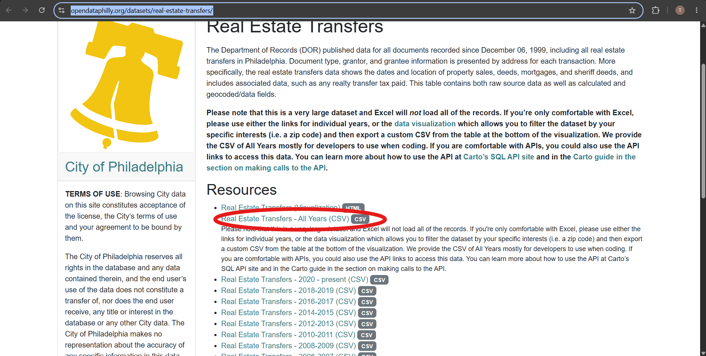

# Data Download Instructions

Follow these steps to obtain the **Real Estate Transfers** dataset required for this project:

1. **Navigate to the Source:**
   Go to the [OpenDataPhilly Real Estate Transfers](https://opendataphilly.org/datasets/real-estate-transfers/) page.

2. **Download the File:**
   Locate and click on **Real Estate Transfers - All Years (CSV)**.
   

3. **Rename and Save:**
   * Rename the downloaded file to **`rtt_summary.csv`**.
   * Move the file to the project directory:
     ```text
     project2/DATA/rtt_summary.csv
     ```
     *(Full path: `\DS4002\DS-4002-group-01\project2\DATA\rtt_summary.csv`)*